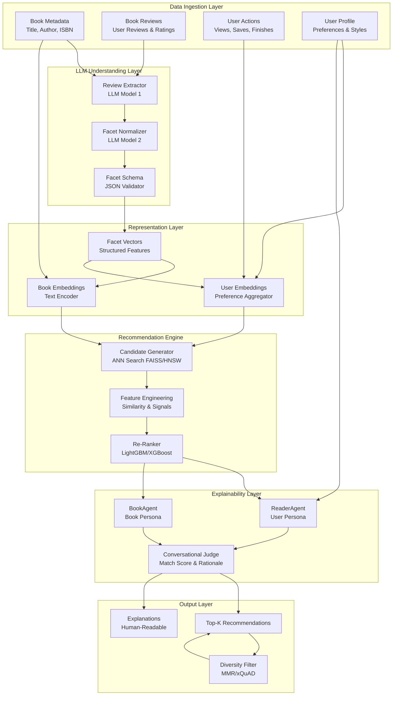
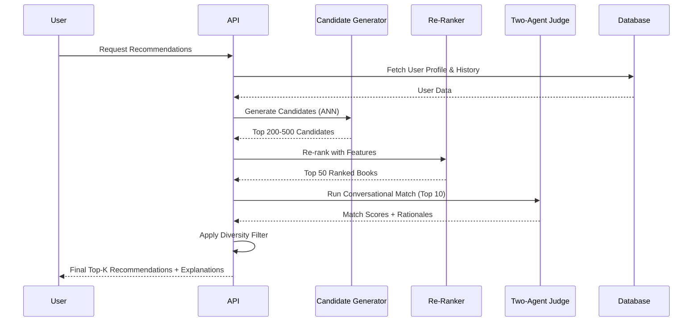

# AI Model System Architecture

**Project**: 서로서로도서관 (Library Together) - AI Recommendation System  
**Last Updated**: 2025-10-16  
**Status**: Design & Implementation Phase

---

## 📋 Executive Summary

This document describes the AI-powered book recommendation system for the Library Together platform. The system implements a **hybrid recommender architecture** that combines:

- **Classic ML** for efficient candidate generation and ranking
- **LLM-based understanding layer** for extracting structured insights from unstructured text (reviews, descriptions)
- **Two-agent conversational matcher** for explainable, personalized recommendations
- **Multi-modal embeddings** for books and users
- **Facet-based representation** using a structured taxonomy

The system is designed to provide highly personalized, explainable book recommendations while respecting user preferences, content warnings, and reading styles.

---

## 🏗️ System Architecture

### High-Level Architecture Diagram



### Component Flow



---

## 🎯 Core Components

### 1. Facet Taxonomy

A structured schema for representing book characteristics:

#### **Style Facets**
- **Pace**: slow, medium, fast
- **Prose Density**: light, standard, lush
- **POV**: first-person, third-person, omniscient
- **Structure**: linear, nonlinear, epistolary
- **Narration Style**: descriptive, dialogue-heavy, introspective

#### **Tone & Mood**
- cozy, dark, whimsical, hopeful, grim, satirical, melancholic, uplifting

#### **Themes**
- friendship, redemption, colonialism, climate, coming-of-age, identity, found-family

#### **Genre & Subgenre**
- **Sci-Fi**: hard, soft, cli-fi, space-opera
- **Fantasy**: low, urban, epic, dark
- **Mystery**: procedural, cozy, noir

#### **Complexity**
- **Vocabulary Level**: simple, moderate, advanced
- **Concept Density**: low, medium, high

#### **Content Warnings**
- violence, sexual-assault, self-harm, gore, profanity, substance-use
- **Intensity**: mild, moderate, graphic

#### **Audience & Length**
- **Audience**: middle-grade, YA, adult
- **Length**: novella, standard, epic

**Schema Format**: JSON Schema for machine validation

---

### 2. LLM Review → Facets Pipeline

#### **Model 1: Extractor**
- **Input**: Single book review (text)
- **Output**: Structured JSON matching facet schema
- **Method**: Few-shot prompting with schema enforcement
- **Validation**: JSON Schema validator

#### **Model 2: Critic/Normalizer**
- **Input**: Multiple facet JSONs from different reviews
- **Output**: Consensus facet vector with confidence scores
- **Method**: 
  - Majority voting across reviews
  - Conflict resolution via confidence weighting
  - Ontology mapping (e.g., "space opera" → sci-fi.subgenre=space_opera)

**Output**: `(book_id → facet_vector, confidence)`

---

### 3. Two-Agent Conversational Matcher

#### **ReaderAgent**
- **Persona**: Built from user profile + recent behavior
- **Attributes**: 
  - Preferred styles (e.g., "slow-burn, cozy vibes")
  - Avoided content (e.g., "graphic violence")
  - Favorite books/authors (e.g., "adored Becky Chambers")

#### **BookAgent**
- **Persona**: Built from book's facet vector + jacket copy
- **Attributes**:
  - Facet summary (e.g., "hopeful, found-family theme")
  - Review consensus distillation
  - Key selling points

#### **Conversation Protocol**
1. **Rounds**: 2-4 dialogue turns
2. **Questions**: ReaderAgent asks: "Will I like this given X?"
3. **Answers**: BookAgent responds with facet citations
4. **Output**: 
   - Match score ∈ [0, 1]
   - Short rationale (e.g., "Because you enjoy slow-burn, character-driven sci-fi with hopeful tone...")

#### **Guardrails**
- Frozen persona cards (no hallucination)
- Token budget cap (cost control)
- Required facet citations (grounding)

---

### 4. Embedding & Candidate Generation

#### **Book Embeddings**
- **Encoder**: MiniLM/MPNet or small LLM embeddings
- **Input**: title + description + author + facets
- **Output**: Dense vector (384-768 dim)

#### **User Embeddings**
- **Method**: Weighted sum of liked books + facet preferences
- **Weighting**: Recency, explicit ratings, implicit signals

#### **ANN Search**
- **Library**: FAISS or HNSW
- **Retrieval**: Top 200-500 candidates
- **Metrics**: Cosine similarity

---

### 5. Re-Ranking Model

#### **Model**: LightGBM / XGBoost (Learning-to-Rank)

#### **Features**
- `dot(user_embed, book_embed)`: Embedding similarity
- `facet_overlap`: Count of matching facets
- `mismatch_penalty`: Unwanted content warnings
- `popularity_prior`: Capped popularity score
- `llm_judge_score`: Two-agent match score
- `recency`: Book publication date
- `diversity_penalty`: Avoid over-clustering

#### **Optimization**
- **Metric**: NDCG@K (K=10/20)
- **Loss**: Pairwise or listwise ranking loss
- **Calibration**: Isotonic/Platt scaling for LLM scores

---

### 6. Synthetic Data Generation

#### **User Personas Library**
- ~200 archetypes (e.g., "cozy SFF enjoyer who dislikes bleak endings")
- Generated via LLM with diverse preferences

#### **Labeling Process**
1. For each `(persona, book)` pair:
   - Run two-agent dialogue
   - Extract match score + rationale
2. **Self-consistency**: Sample 3 seeds, take median
3. **Hard negatives**: Generate near-miss books (same genre, opposite tone)
4. **Safety filter**: Down-weight unsafe pairs (e.g., under-18 + explicit content)

#### **Training Data**
- Features: All re-ranker features
- Labels: LLM-judge scores (calibrated)
- Size: ~50K-100K synthetic pairs

---

## 🔄 Recommendation Pipeline

### End-to-End Flow


### Cold-Start Handling

#### **Cold-Start User**
- Quick onboarding: 5-10 preference cards
- Pin key facets: pace, tone, 2-3 themes to seek/avoid
- Fallback: Popular books matching stated preferences

#### **Cold-Start Item**
- Rely on LLM facets + text encoder
- No collaborative filtering signals
- Boost exploration weight

---

## 📊 Evaluation Strategy

### Offline Metrics
- **Recall@100**: Candidate generation quality
- **NDCG@10**: Final ranking quality
- **Coverage**: % of catalog recommended
- **Catalog Entropy**: Diversity across recommendations
- **Serendipity**: Unexpected but relevant hits

### Human Evaluation
- **Sample**: 50 profiles × 50 books
- **Metrics**:
  - Correlation: LLM-judge vs. human yes/no
  - Explanation quality: Likert scale (1-5)
  - Facet accuracy: Manual facet validation

### Online Metrics (A/B Testing)
- **Engagement**: CTR, save/add-to-shelf, completion rate
- **Quality**: Long-click, hide/report rate
- **Safety**: Content warning compliance
- **Diversity**: Genre distribution in user feeds

---

## 🛡️ Privacy, Safety & Fairness

### Privacy
- No free-text PII in embeddings
- Hashed user IDs
- Opt-out mechanism for personalization

### Safety
- Content warnings respected by default
- User controls: hide/show warnings
- Age-appropriate filtering

### Fairness
- Audit facet distributions for bias
- Niche genre exposure quotas
- Avoid filter bubbles via diversity injection

---

## 🚀 Technology Stack

### ML/AI Frameworks
- **PyTorch**: Deep learning models
- **Transformers (Hugging Face)**: LLM integration
- **Sentence-Transformers**: Text embeddings
- **LightGBM/XGBoost**: Re-ranking models
- **FAISS**: ANN search

### Data Processing
- **NumPy & Pandas**: Data manipulation
- **Scikit-learn**: Feature engineering, calibration

### Model Serving
- **FastAPI**: Inference API
- **Celery**: Background batch processing
- **Redis**: Caching & task queue

### Development Tools
- **Jupyter**: Model experimentation
- **MLflow**: Experiment tracking
- **DVC**: Data version control

---

## 📁 Directory Structure

```
ai-model/
├── data/                   # Training & evaluation data
│   ├── raw/               # Raw book & review data
│   ├── processed/         # Cleaned & featurized data
│   └── synthetic/         # Synthetic training pairs
├── models/                # Trained model artifacts
│   ├── embeddings/        # Text encoder models
│   ├── rankers/           # Re-ranking models
│   └── llm/               # LLM configs & prompts
├── notebooks/             # Jupyter notebooks for experiments
│   ├── facet_extraction.ipynb
│   ├── embedding_training.ipynb
│   └── evaluation.ipynb
├── src/                   # Source code
│   ├── data/              # Data processing pipelines
│   ├── models/            # Model implementations
│   ├── agents/            # Two-agent system
│   ├── inference/         # Serving & API
│   └── evaluation/        # Metrics & evaluation
├── tests/                 # Unit & integration tests
├── configs/               # Configuration files
│   ├── facet_schema.json  # Facet taxonomy schema
│   └── model_config.yaml  # Model hyperparameters
├── pyproject.toml        # Project metadata & dependencies
└── SUMMARY.md            # This file
```

---

## 🔮 Future Enhancements

### Phase 1: MVP (Current)
- Basic facet extraction
- Embedding-based candidate generation
- Simple re-ranker
- Two-agent explainability

### Phase 2: Advanced Features
- Multi-modal embeddings (book covers)
- Session-level intent tracking
- Real-time feedback loop
- A/B testing framework

### Phase 3: Scale & Optimization
- Distributed training
- Model compression (quantization)
- Edge deployment (on-device inference)
- Federated learning for privacy

---

## 📚 References

- **Facet Taxonomy**: Inspired by Goodreads, StoryGraph
- **Two-Agent System**: Constitutional AI, Debate-based methods
- **Hybrid Recommenders**: Netflix, Spotify architectures
- **LLM Calibration**: Platt scaling, temperature tuning

---

**Maintained by**: Team 10 - SWPP 2025  
**Contact**: [GitHub Issues](https://github.com/snuhcs-course/swpp-2025-project-team-10/issues)
